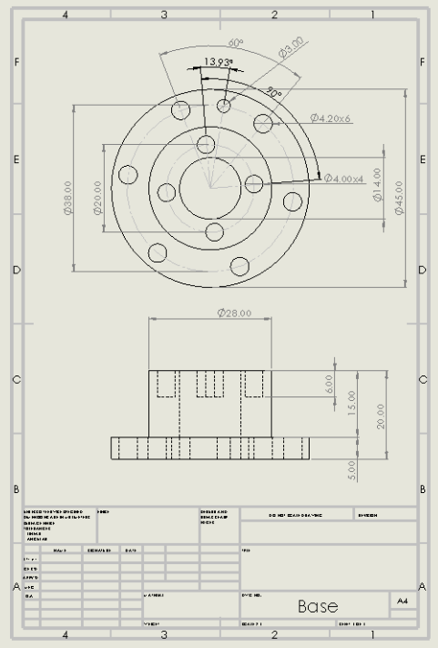
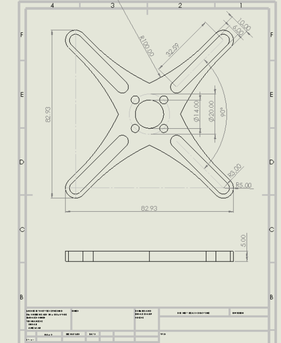
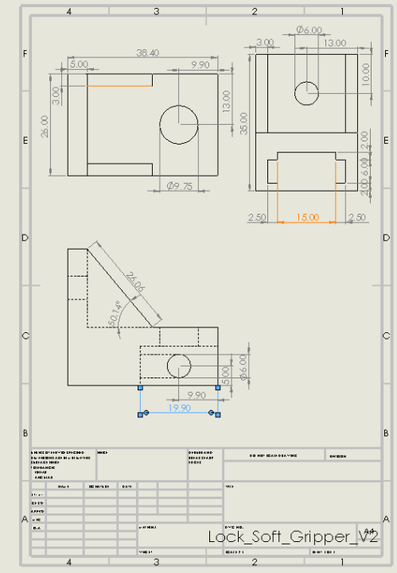
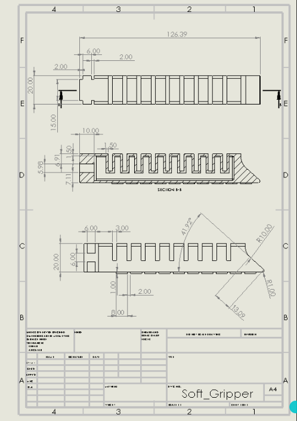

# Soft_Pneumatic_Gripper

This is a project done by first-year students from the Panyapiwat Institute of Management (PIM) in Thailand , Soft Gripper is basic pneumatic system of class.  
The details of the project are for learning purposes only and cover only the basic design of the Soft Gripper.  
There was no physical testing of the flexibility and physical durability of the Soft Gripper.  

## Overview

   

## Drawing
2D drawing in design

   
 

## Development
Tools used in development
- RobotStudio Suite | ABB
- SOLIDWORKS | 3D CAD Design Software & PDM Systems
