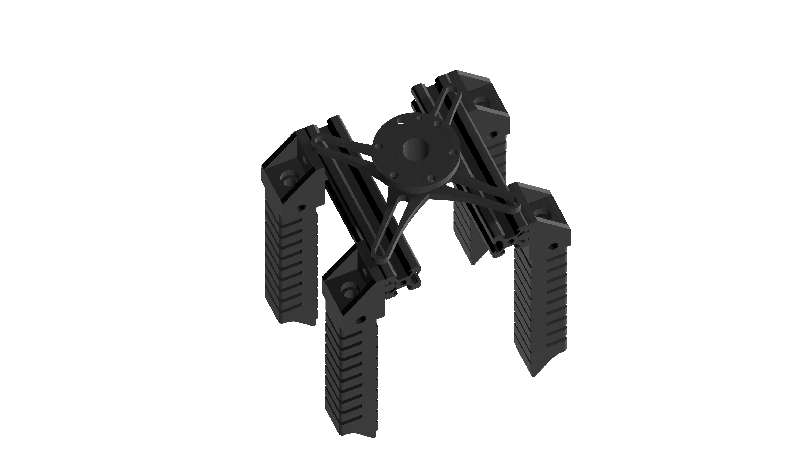

# Soft Pneumatic Gripper

Welcome to the Soft Pneumatic Gripper project! This project was developed by first-year students from the Panyapiwat Institute of Management (PIM) in Thailand. The Soft Gripper is a basic pneumatic system designed as part of their coursework.

## 📚 Learning Purpose

Please note that the details provided in this project are for learning purposes only and cover the basic design of the Soft Gripper. No physical testing was conducted to evaluate the flexibility and physical durability of the Soft Gripper.

## 🛠️ Development Tools

The following tools were used in the development of this project:
- RobotStudio Suite | ABB
- SOLIDWORKS | 3D CAD Design Software & PDM Systems

## 🖼️ Overview

Take a look at the Soft Gripper design:

  
  

## 📏 Drawing

  <table>
    <tr>
      <td align="center">
        
         
        Base
      </td>
      <td align="center">
        
         
        Gripper
      </td>
    </tr>
    <tr>
      <td align="center">
        
         
        Lock
      </td>
      <td align="center">
        
         
        Soft Gripper
      </td>
    </tr>
  </table>

## 🤝 Contributions

We appreciate your interest in the Soft Pneumatic Gripper project! As this project was developed for learning purposes, we are not actively seeking contributions at this time. However, feel free to explore the design and use it as a reference for your own projects.

## 📧 Contact

If you have any questions or inquiries about this project, please feel free to reach out to the project maintainers.

Thank you for checking out the Soft Pneumatic Gripper project!
